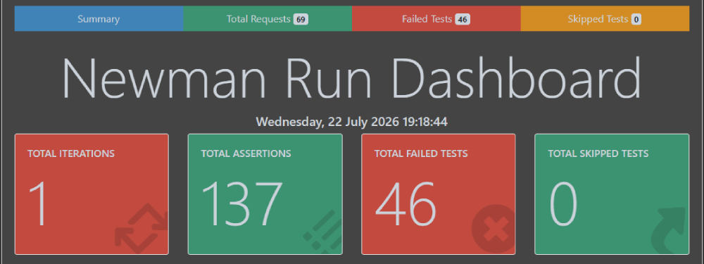
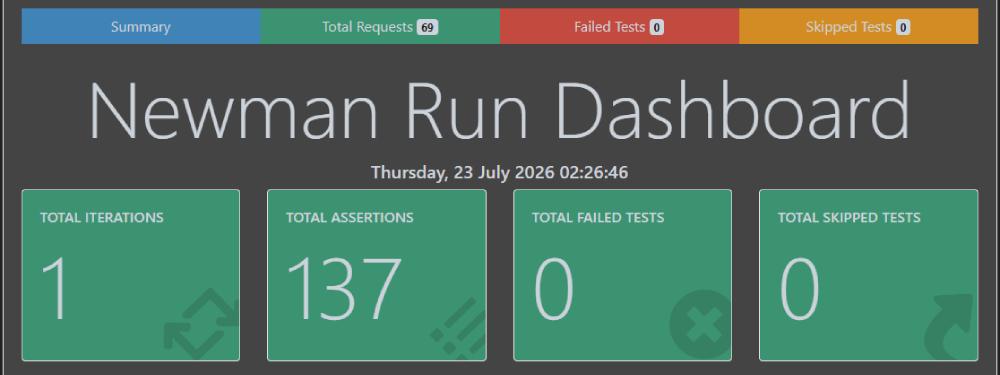

# SSCentral API - QA Audit & Automation Suite

   

This repository contains the complete automated test suite and QA audit documentation for the **SSCentral API** (v2). 

SSCentral is the backend platform supporting the mobile rhythm game ***[FiveSteps](http://fivestepsgame.com/ "FiveSteps: Rhythm Game")*** (published on [Google Play](https://play.google.com/store/apps/details?id=com.xsandartech.fivesteps&hl=en "Google Play")). This suite covers player authentication, song discovery, voting, hash verification, song downloads, and community pack browsing.

---

## 📊 Audit & Regression Results Summary

The QA cycle consisted of an initial baseline audit followed by failure analysis, bug fixes, and a full regression test run.

| Test Metric | Initial Baseline Run | Final Regression Run |
| :--- | :---: | :---: |
| **Total Requests** | 69 | 69 |
| **Total Assertions** | 137 | 137 |
| **Passed Assertions** | 91 (66.4%) | **137 (100%)** |
| **Failed Assertions** | 46 (33.6%) | **0 (0%)** |
| **Total Duration** | 7.0s | 6.9s |
| **Suite Outcome** | ❌ Failed | ✅ Passed |

---

## 🖼️ Newman Execution Dashboards

### Phase 1: Initial Baseline Audit (46 Failures Identified)
During the initial test execution, 46 assertions failed out of 137 due to backend defects and test assertion mismatches.

🔗 **[View Full Interactive Baseline Report (Live HTML)](https://xsandartech.github.io/sscentral-api-qa-testing/reports/SSCentral-In-Game-API-Initial-Report.html)**

---

### Phase 2: Final Regression Run (100% Pass Rate)
After fixing backend bugs and updating test script assertions, the full regression suite was executed, achieving a 100% pass rate.

🔗 **[View Full Interactive Regression Report (Live HTML)](https://xsandartech.github.io/sscentral-api-qa-testing/reports/SSCentral-In-Game-API-Regression-Report.html)**

---

## 📂 QA Documentation

Detailed QA artifacts created during this testing project:

* 📋 **[Test Plan (TEST_PLAN.md)](docs/TEST_PLAN.md)** — Outlines test objectives, scope, environment setup, testing strategy, and exit criteria.
* 🐛 **[Defect Report & Failure Analysis (DEFECT_REPORT.md)](docs/DEFECT_REPORT.md)** — Documents 5 representative issues (4 API defects + 1 test design mismatch) with root causes, fixes, and verification details.

---

## 🎯 Test Scope & Coverage

The test suite contains **69 requests** organized into **6 submodules**:

| Folder / Module | Focus Area | Requests |
| :--- | :--- | :---: |
| **00 - Player Authentication** | Firebase Auth login & JWT retrieval | 1 |
| **01 - Song Discovery** | Default feeds, search queries, pagination, and boundary parameters | 26 |
| **02 - Voting** | Song/pack voting, duplicate vote handling, unapproved song restrictions | 13 |
| **03 - Hash Verification** | SSC chart hash validation and route security checks | 15 |
| **04 - Song Download** | Downloading approved content and handling non-existent songs | 6 |
| **05 - HUB & Community Packs** | Browsing featured and community-submitted song packs | 8 |